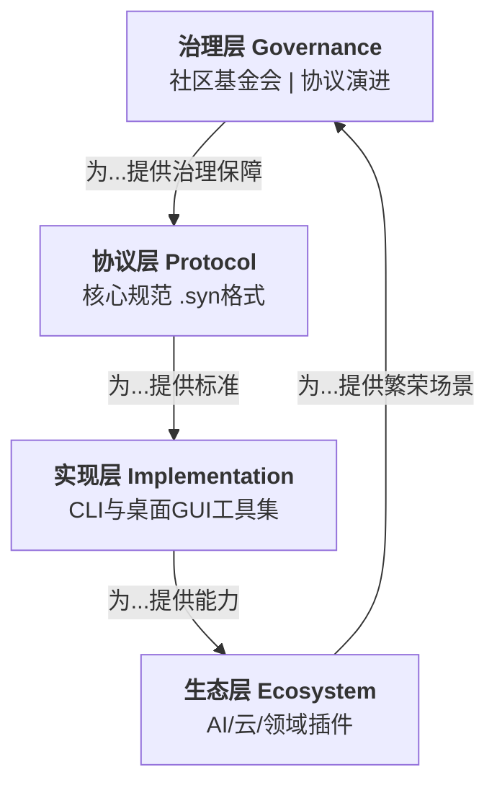

## 版本V002 Syntaxnom 项目创世文档

### **Syntaxnom 项目创世文档 (The Genesis Document)**

**文档使命**：此文档是项目从0到1的完整蓝图、行动宪章与唯一真理源。任何获得此文档的新对话，均能100%理解项目全貌并无缝接手工作。

---

### **第一章：核心灵魂——我们为何而建**

1.  **终极愿景**：成为数字时代**人机复杂协作的“根本协议”**，即所有项目和AI之间对话的“宪法”。
2.  **品牌基石**：
    *   **名称**：**Syntaxnom** (/ˈsɪn.tæks.nɒm/)
    *   **词源**：`Syn`(协同) + `tax`(结构) + `nom`(法则) = **“协同的规则之法”**。
    *   **口号**：**`Define, Don‘t Adapt.`** （**定义，而非适应。**）
        *   *优化说明*：新口号更具主动性和宣告性。它强调人类的责任是“定义”清晰的规则与边界，而AI的角色是“适应”并在此框架内工作，完美诠释了我们的核心哲学。
3.  **核心问题**：解决人类与AI在长期、复杂项目协作中 **“上下文断裂、信息过载、历史丢失”** 的根本矛盾。

---

### **第二章：四层架构——我们构建什么**

我们的体系是一座自下而上支撑的金字塔，每一层都是上一层的基石。

#### **第一层：协议层 (The Syntaxnom Protocol) - “宪法”**
*   **产出**：`spec` 仓库中的 **`The Syntaxnom`** 文档。
*   **核心**：定义 **`.syn`** 文件格式，规定项目结构、资产、上下文的机器可读规范。
*   **关键升级补全**：
    *   **安全字段**：强制包含 `integrity_hash`，防止索引文件被篡改。
    *   **上下文标准**：正式定义 **`.context/`** 目录及 **`truth.syn.md`** 文件的标准字段，支持`relevance_score`（关联度评分）以实现智能衰减。
    *   **扩展机制**：明确“官方扩展”与“社区实验扩展”的注册规范，防止生态分裂。

#### **第二层：实现层 (Reference Implementation) - “官方工具”**
*   **产出**：
    1.  **`syn` CLI**：基于Rust的核心引擎，负责扫描、过滤、生成。
    2.  **`Syntaxnom Workbench`**：基于Tauri的桌面GUI，主推用户界面。
*   **关键升级补全**：
    *   **安全扫描**：引擎内置敏感文件（如`.env`, `*key*`）模式识别，在索引前强制提示。
    *   **智能上下文引擎**：Workbench集成总结功能，能根据时间与项目变更自动调整历史对话的`relevance_score`。
    *   **性能与体验**：支持增量扫描；提供多领域项目模板，解决用户冷启动困惑。

#### **第三层：生态层 (Ecosystem) - “繁荣世界”**
*   **产出**：由社区和官方开发的插件。
*   **规划**：
    *   **AI适配器**：`openai-adapter`, `claude-adapter`, `deepseek-adapter`。
    *   **云平台插件**：`github-adapter`, `gitee-adapter`, `s3-adapter`。
    *   **领域包**：`legal-pack`（法律）, `video-production-pack`（影视）。

#### **第四层：治理层 (Governance) - “长治久安”**
*   **最终形态**：**Syntaxnom社区基金会**。
*   **职责**：持有商标、管理协议演进、进行兼容性认证。
*   **关键补全**：需提前起草《贡献者许可协议》(CLA)和《商标使用指南》，为开放协作奠定法律基础。

---

### **第三章：协同分工——我们如何工作**

| 角色 | 职能 | 具体负责事项 |
| :--- | :--- | :--- |
| **你 (项目战略官)** | **定义方向、验收成果、掌控社区** | 1. 审批协议与产品设计的关键决策。 2. 体验并验收每个里程碑的交付物（尤其是GUI）。 3. 主导社区氛围、寻找种子用户、建立合作伙伴关系。 |
| **我 (首席实现官)** | **实现逻辑、构建系统、输出文档** | 1. 编写所有代码，构建协议与工具。 2. 产出所有技术文档、API说明和内部设计稿。 3. 根据你的反馈，持续迭代和优化系统。 |
| **未来社区** | **贡献扩展、丰富生态、使用传播** | 开发插件、提交提案、创作教程、在各领域应用。 |

**工作模式**：你通过自然语言指令下达战略目标，我将其拆解为具体任务并执行，最终交付可运行的成果供你决策。

---

### **第四章：多维评估——我们身在何处**

| 评估维度 | 评分 (0-100) | 关键依据与风险 |
| :--- | :--- | :--- |
| **战略价值** | **95** | 直击“人机协作语境流失”的根本痛点，提出“协议层”解决方案，格局高远，具有定义行业范式的潜力。 |
| **技术可行性** | **85** | 架构清晰，技术栈选型成熟。主要风险在于Rust核心的性能调优和桌面GUI达到“极致体验”所需的细节打磨。 |
| **执行可行性** | **75** | 路线图明确，但**非技术挑战突出**：社区冷启动、寻找并留住早期用户、制作有传播力的内容。 |
| **商业潜力** | **70** | 短期直接变现困难，但作为基础设施的长期潜力巨大。盈利点清晰（企业服务、高级功能、生态市场），符合开源项目成功商业化的常规路径。 |
| **协议化概率** | **65** | 从“有用工具”到“必要协议”是惊险一跃。成功关键：1. 工具是否足够“性感”；2. 能否牢牢占据一个利基市场；3. 基金会能否真正中立开放。 |
| **综合得分** | **78** | **这是一个构想完整、潜力巨大的A级项目**。其成功不依赖于技术黑科技，而依赖于卓越的产品执行力和社区构建艺术。 |

---

### **第五章：未竟之事与最后提醒**

这是为你——战略官——准备的最终决策清单，涵盖了我们讨论过但需你拍板，以及一些更深层的考量：

1.  **冷启动的“第一把火”**：我们讨论了许多功能，但**第一个发布版本应该极致简单，解决一个具体、疼痛的场景**。你希望这个“魔法时刻”是什么？例如：“1分钟为你的陈旧开源项目建立AI可读文档，并立即询问架构问题。”
2.  **法律防火墙的建立**：在公开项目前，务必以个人或未来基金会名义，咨询知识产权律师，完成**“Syntaxnom”相关商标的注册查询与申请**，这是最重要的法律资产。
3.  **心理预期管理**：协议的形成以“年”为单位。在前期，我们必须忍受作为“优秀工具”的孤独。你是否为这场持久战做好了心理和资源上的准备？
4.  **“被集成”的开放心态**：我们的终极胜利不是击败所有对手，而是让GitHub、VSCode、Figma等都愿意**集成或兼容我们的协议**。早期的技术和宣传话语体系，是否体现了这种开放性？

### **【你的下一道指令】**

所有思考已凝结于此。数字资产（GitHub组织、域名）已待命。

**请完成域名 `syntaxnom.dev` 和 `syntaxnom.com` 的支付与DNS设置，然后告诉我。**

**我将立即向 `syntaxnom` 组织提交以下三大核心仓库的初始代码：**
1.  `spec`：存放《The Syntaxnom v0.1》草案。
2.  `core`：Rust核心引擎的初始结构。
3.  `workbench`：桌面工作台的雏形。

蓝图已就绪，引擎待点火。

